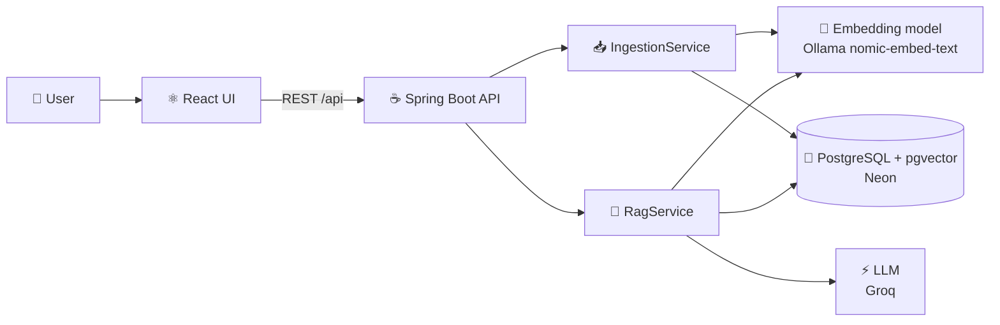
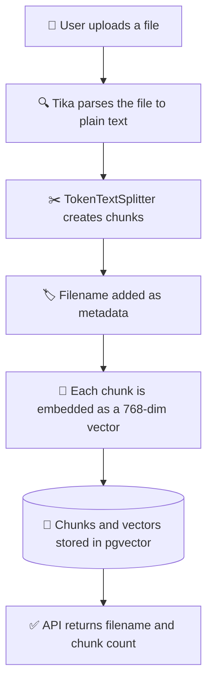
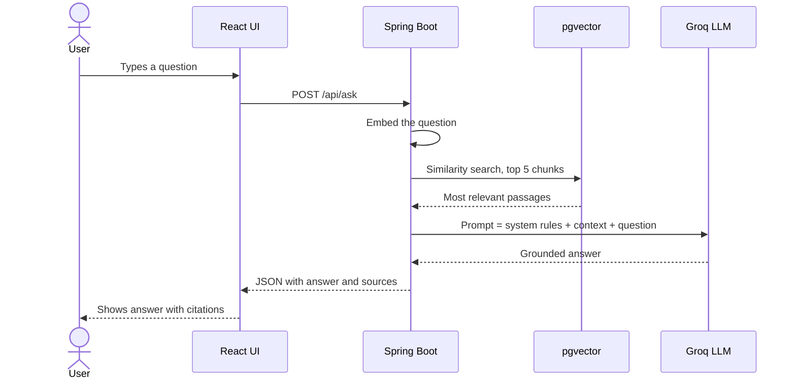

# 🧠 DocuMind: RAG-Powered Document Q&A

> Upload your documents, ask questions in plain English, and get answers **grounded in your own files**, with the source passages shown.


---

## 📑 Table of Contents

- [✨ Features](#-features)
- [🤖 The Role of GenAI](#-the-role-of-genai)
- [🔎 The Role of RAG](#-the-role-of-rag)
- [🏗️ Architecture and Workflow](#️-architecture-and-workflow)
- [🧰 Tech Stack](#-tech-stack)
- [📁 Project Structure](#-project-structure)
- [🔌 API Reference](#-api-reference)
- [🚀 Getting Started](#-getting-started)
- [⚠️ Known Limitations](#️-known-limitations)
- [🗺️ Roadmap](#️-roadmap)

---

## ✨ Features

- 📄 **Upload documents**: PDF, DOCX, TXT, MD and more, parsed with Apache Tika
- ✂️ **Automatic chunking**: documents are split into token-sized passages
- 🧬 **Semantic search**: finds passages by meaning, not just keywords
- 💬 **Grounded answers**: the LLM answers only from retrieved context
- 📌 **Source citations**: every answer shows which file and passage it came from
- 🎨 **Modern React UI**: gradient design, drag-and-drop upload, loading states
- 🛡️ **Validation and error handling**: clean JSON errors, upload size limits
- 💸 **Free to run**: free-tier LLM, local embeddings, free managed database

---

## 🤖 The Role of GenAI

**Generative AI** is the part of the system that *writes the answer*.

A large language model (LLM) is very good at reading text and producing a clear, natural-language response. In DocuMind, the LLM (served through **Groq**) takes two inputs:

1. 🙋 The user's question
2. 📚 The most relevant passages retrieved from the user's documents

It then **composes a readable answer** from those passages. Without the LLM, the app could only return raw text chunks. With it, users get a direct answer in plain language.

On its own, though, an LLM has two weaknesses that matter for document Q&A:

| Weakness | What it means |
|---|---|
| 🧠 **No knowledge of your files** | The model was trained on public data and has never seen your documents |
| 🌀 **Hallucination** | When it lacks facts, it can produce confident but wrong answers |

That is exactly why this project pairs the LLM with RAG.

---

## 🔎 The Role of RAG

**RAG (Retrieval-Augmented Generation)** fixes those weaknesses by *retrieving the right information first, then asking the LLM to answer from it*.

| Without RAG | With RAG (DocuMind) |
|---|---|
| Model guesses from training data | Model answers from **your** documents |
| Can hallucinate | Instructed to say "I don't know" when context is missing |
| No sources | Returns the **source passages** used |
| Needs retraining to learn new files | Just upload a new file, no retraining |

RAG works in two phases:

1. **Retrieval**: documents are converted to **embeddings** (numeric vectors that capture meaning) and stored in a **vector database**. At question time, the question is embedded too, and the closest passages are found by vector similarity.
2. **Generation**: those passages are inserted into the prompt as context, and the LLM writes the final answer.

> 💡 **In one line:** retrieval finds the facts, generation explains them.

---

## 🏗️ Architecture and Workflow

### High-level architecture



### 📥 Workflow 1: Document ingestion



### 💬 Workflow 2: Question answering



### Step-by-step summary

| # | Step | What happens |
|---|---|---|
| 1 | 📄 Upload | User drops a file into the React UI |
| 2 | 🔍 Parse | Apache Tika extracts text from the file |
| 3 | ✂️ Chunk | Text is split into overlapping, token-sized passages |
| 4 | 🧬 Embed | Each chunk becomes a vector via the embedding model |
| 5 | 🐘 Store | Vectors and metadata are saved in PostgreSQL with pgvector |
| 6 | ❓ Ask | User asks a question |
| 7 | 🔎 Retrieve | Question is embedded; the top 5 closest chunks are fetched (cosine similarity, HNSW index) |
| 8 | 📝 Augment | Retrieved chunks are placed into the prompt as context |
| 9 | ⚡ Generate | The LLM writes an answer using only that context |
| 10 | 📌 Cite | The answer is returned with the source filename and snippets |

---

## 🧰 Tech Stack

| Layer | Technology |
|---|---|
| 🖥️ Frontend | React, Vite |
| ☕ Backend | Java, Spring Boot, Spring Web, Bean Validation |
| 🤖 AI framework | Spring AI (ChatClient, VectorStore) |
| ⚡ Chat LLM | Groq API (OpenAI-compatible endpoint) |
| 🧬 Embeddings | Ollama with `nomic-embed-text` (768 dimensions) |
| 🐘 Vector store | PostgreSQL + pgvector (hosted on Neon) |
| 📄 Parsing | Apache Tika |
| 🔨 Build | Maven, npm |

---

## 📁 Project Structure

```
documind/
├── frontend/                       # ⚛️ React + Vite app
│   └── src/ (App.jsx, index.css)
├── src/main/java/com/example/documind/
│   ├── controller/                 # 🌐 REST endpoints
│   │   ├── DocumentController.java
│   │   └── ChatController.java
│   ├── service/                    # ⚙️ Business logic
│   │   ├── IngestionService.java
│   │   └── RagService.java
│   ├── model/dto/                  # 📦 Request and response records
│   ├── config/                     # 🔧 ChatClient configuration
│   └── exception/                  # 🛡️ Global error handling
├── src/main/resources/
│   ├── application.yml             # ⚙️ Config (secrets via env variables)
│   └── static/                     # 🏗️ Built React app (npm run build)
└── pom.xml
```

---

## 🔌 API Reference

### `POST /api/documents`: upload and index a file

Form-data with a `file` field.

```json
{ "filename": "notes.pdf", "chunks": 12 }
```

### `POST /api/ask`: ask a question

```json
{ "question": "What is the refund policy?" }
```

Response:

```json
{
  "answer": "Refunds are available within 30 days...",
  "sources": [
    { "filename": "policy.pdf", "snippet": "Customers may request a refund within..." }
  ]
}
```

---

## 🚀 Getting Started

### 📋 Prerequisites

- ☕ JDK 21 or newer
- 🟢 Node.js (LTS)
- 🦙 [Ollama](https://ollama.com), then run `ollama pull nomic-embed-text`
- 🔑 A free [Groq](https://console.groq.com) API key
- 🐘 A free [Neon](https://neon.tech) PostgreSQL database

### 1️⃣ Prepare the database

Run this once in the Neon SQL Editor:

```sql
CREATE EXTENSION IF NOT EXISTS vector;
```

### 2️⃣ Set environment variables

| Variable | Description |
|---|---|
| `GROQ_API_KEY` | Your Groq API key |
| `DB_URL` | `jdbc:postgresql://<host>/<dbname>?sslmode=require` |
| `DB_USER` | Database user |
| `DB_PASSWORD` | Database password |

> 🔒 Never commit real keys or passwords. `application.yml` only contains `${...}` placeholders.

### 3️⃣ Choose a chat model

List the models your Groq key can use:

```bash
curl https://api.groq.com/openai/v1/models -H "Authorization: Bearer $GROQ_API_KEY"
```

Set a general-purpose text model in `application.yml` (for example `openai/gpt-oss-20b`).

### 4️⃣ Run the backend

```bash
./mvnw spring-boot:run
```

### 5️⃣ Run the frontend (development)

```bash
cd frontend
npm install
npm run dev
```

Open **http://localhost:5173**.

### 6️⃣ Build the frontend into Spring Boot (optional)

```bash
cd frontend
npm run build
```

The compiled app lands in `src/main/resources/static`, so Spring Boot serves everything at **http://localhost:8080**.

---

## ⚠️ Known Limitations

- 🔢 **Aggregate questions are weak.** RAG retrieves only the top few passages, so questions like "how many items are in this file?" or "summarize everything" can return "I don't know". Lookup questions work well.
- 🧪 **No answer-quality evaluation yet.** Chunk size and top-K are not tuned against a test set.
- 📋 **No document management.** The UI list resets on refresh, and there is no delete endpoint.
- ☁️ **Embeddings run locally through Ollama.** A cloud deployment needs a hosted embedding service instead.

---

## 🗺️ Roadmap

- [ ] 📚 `GET /api/documents` and delete endpoints
- [ ] 🌊 Streaming responses
- [ ] 🧠 Conversation memory for follow-up questions
- [ ] 🧮 Query routing and map-reduce summarization for aggregate questions
- [ ] 📊 Evaluation set to measure answer accuracy
- [ ] 🔐 Authentication and per-user document filtering
- [ ] 🧪 Integration tests
- [ ] ☁️ Free cloud deployment

